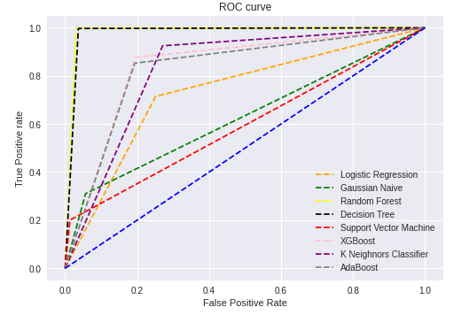
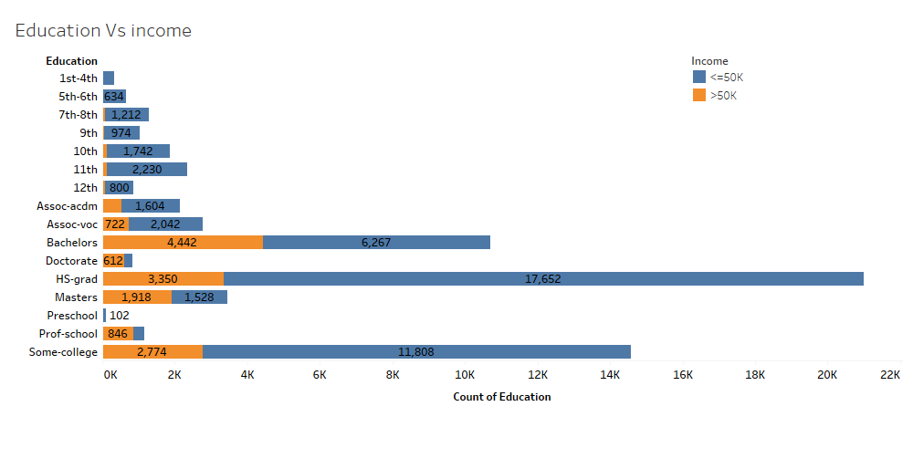
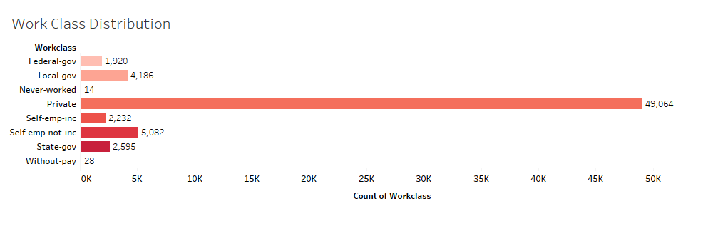
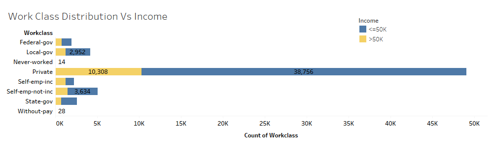
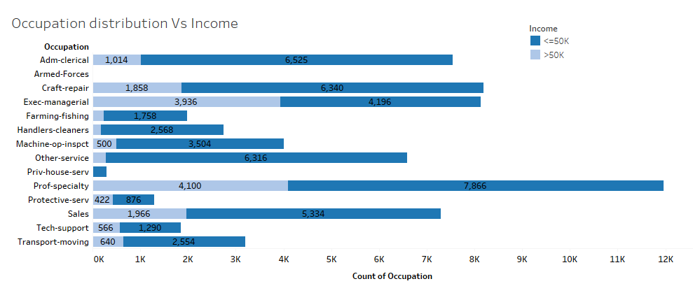
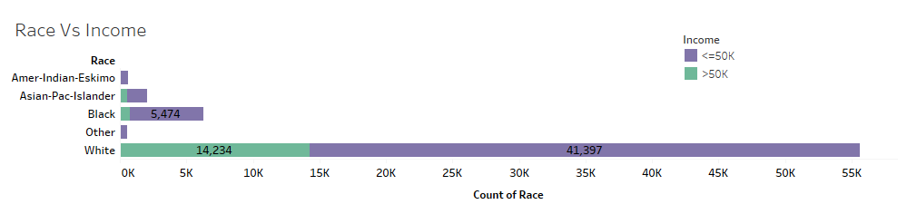
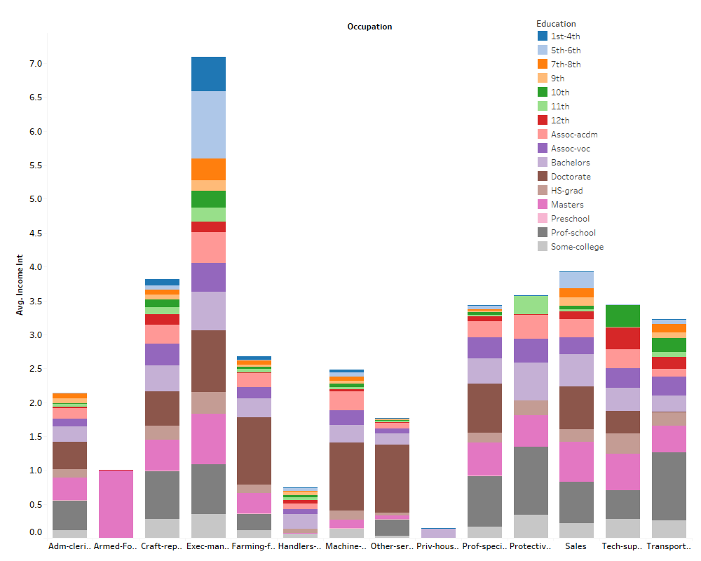
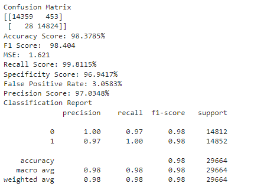

# Analysis of Census Income data using Machine-learning analysis
## 2.Introduction
 Every nation around the world face imbalance between the wealth and income. United States is one among those nations. One of the best solutions to maintain economic imbalance is by eradicating poverty in nations. This helps the nations to develop and improvise the economic imbalance. It is important for all the countries to find a best and optimal solution to control this problem. The main aim of this project is not only to make the poor substantial but also identify the predominant features essential to improve one’s income. To address the economical imbalance, machine learning and data mining techniques are performed on UCI adult dataset. This project addresses the global problem and provides optimal solutions by performing the following the analysis on the data set: data cleaning, Explanatory Data Analysis, Hypothesis Development, Data Analysis, Machine Learning, and Data visualization. This proposed project, helps me to implement all the necessary analysis discussed above that are required for a successful completion of data science project and helps find a solution for global problem. Hence, this project is a best fit for me to finish my study in data science. I want to learn more about ANOVA, Machine Learning algorithms and Data Visualizations using tableau. The initial phase of the project includes Data Collection, Data Cleaning and Explanatory Data Analysis. In the second phase, hypothesis are developed, data visualization using tableau and machine learning models are performed. The literature section below discuses about the existing state of the artwork that is comparable to the study of research suggested in the paper. 
## 3.Statement of Problem
 The UCI Adult dataset is used to eradicate the imbalance between wealth and income. This is done by performing classification on a set of attributes to anticipate if an individual’s annual income in the United States fits into the income segments of greater than 50k Dollars or less than or equal to 50k Dollars. It also helps us determine the features or attributes that makes a person to have earn less by developing few hypothesis. These features can be used as areas to improvement by the government to address the global problem.   This study applies all the phases (data collection, data preparation, Explanatory Data Analysis, Modeling, Machine learning models, Model Evaluation and interpreting the results) of a data science project to obtain the results for the described research question. The research aims to find a solution for a global problem faced by many nations’ government.  
## 4.Related Work
<b>4.1. Purpose of Study</b>

 In this paper, the author predicted the income build on population survey done by U.S. Census Bureau. Super Vector Machines and Principal component analysis are used to perform the analysis. The paper also concentrates on how to improve the efficiency and accuracy of model by selecting the appropriate feature. In this process grid parameter search, training time, accuracy and number of super vectors are considered as suitable features for the study. This paper talks about data preprocessing, SVM, PCA, Comparing the accuracy between the subsets which can be implemented on my dataset to predict the income levels. I intend to work on SVM algorithm for my research project and this paper has motivated me to apply the SVM algorithm on my dataset. (Alina, 2004) 

<b>4.1.2. Related Literature</b>

 The Key concepts involved in the paper are Super vector Machines, Principal component Analysis, Data Preprocessing, SVM Grid Search, accuracy, ROC curve. This paper has reviews 16 articles.

<b>4.1.3. Research Design</b>
  
 The dataset used in this paper is the population survey data from U.S. Census Bureau. It contains data about social, demographic, other characteristics of work force that is 16 years old and records the details of employment, unemployment, and income. Due to the huge size of the data, this study used many data mining methods like neural networks, KNN, decision tree and SVM. In this paper the features of SVM and PCA are discussed. The Super vector machine follows two steps: uses a series of related functions called Kernel and hyperplane learning algorithm is implemented on the kernel. The dataset will be split into training and test data before applying SVM algorithm on the dataset. Gaussian Kernel can be used with SVM to train the dataset systematically by using Cross validation on the train dataset and implement Grid search. PCA is an approach that is used to divide the large dataset into small dataset using the independent variables. The results of these smaller sets will be like the results of larger sets because the smaller sets are the subsets of the larger sets. PCA uses Eigen vectors and Eigen values to obtain the principal components i.e., smaller sets.
 There is a life cycle that needs to be followed for completion of a data science research. One of the important phases is data preprocessing. Data Preprocessing should be applied on the dataset to remove the noisy data from the dataset. This phase should be implemented before executing the machine learning algorithms on the dataset. 

<b>4.1.4. Conclusion </b>

 To conclude, the huge dataset was divided into six subsets and the classification conclusions for SVM and PCA are showcased in the paper. The above six subsets are used to compare the performance and training time of SVM algorithm. All the six datasets are classified based on accuracy and ROC. The ROC graphs consists of classification rate and the number of false positive rate. To reduce the dataset with large independent values PCA is used. The classification error rate for algorithms is predicted. In future, this study can be extended by using Kernel PCA method for improving the classification error rate.

<b>4.2. Purpose of Study</b>

 The Two-class Boosted Decision Tree algorithm will be used in this study to determine if a person's annual income is over or below $50,000 based on census data. To review and analyze the data, the author used a machine learning technology. The program predicts a person's income based on a variety of criteria from the dataset. Finally, the paper seeks to evaluate whether persons with more education earn more money. This paper talks about steps of machine learning, what factors are important to gain higher income and Two-Class Boosted Decision Tree which can be implemented on my dataset to predict the income levels. I intend to work on supervised algorithms for my research project and this paper has motivated me to apply supervised algorithms on my dataset. (Victor, 2016) 

<b>4.2.1. Related Literature</b>

 The key concepts covered in the paper are Machine Learning, Two-class boosted decision tree, predictive analysis, supervised learning, unsupervised learning. This paper has reviewed 3 papers to attain the purpose of the study.

<b>4.2.2. Research Design or Strategy</b>

 There are few steps that machine process follows to obtain solution for a research question in no time. The steps include data collection, creating a model, evaluating the model, refining the model, deploying the model, and testing the final model. Microsoft Azure Machine Learning studio is used to analyze a solution for the research question. Machine Learning algorithms are classified into three different algorithms: Classification, regression, and Clustering algorithms. Classification algorithms are used to predict data based on discrete variables which regression and clustering are used to predict data on continuous, grouping data for a given variable. Supervised and Unsupervised are the two types in machine learning. Classification and Regression algorithm fall under supervised machine learning techniques and cluster analysis falls under unsupervised learning algorithms.
 Two-Class Boosted Decision tree is an algorithm which is centered on boosted decision trees. In boosted decision trees, the mistakes of first trees are rectified by second trees and the mistakes of first and second trees are rectified by third trees. The predictions are made based on the correction of all the trees. Irrespective of predicting the results collaboratively by all the trees, the boosted decision trees accumulates more memory and is not suggestable for analyzing huge datasets. Before applying the algorithm on dataset, the data is split into train and test (80% and 20% respectively).

<b>4.2.3. Results and Conclusion</b>

 Machine Learning is the best technique to make predictions from many variables. For the above research the author used machine to predict if education one of the important factors to obtain a better income. The graphs are plotted between false positive rate Vs true positive rate, Precision Vs Recall, and no. of true positives Vs Positive rate to conclude which features are deciding factors for high income. According to the results, education and occupation have a major contribution for obtaining high income.

<b>4.3. Purpose of Study </b>

 This paper uses an unsupervised machine learning classification algorithm. The classification algorithms forecast the value of a categorical variable based on other variables in a dataset. This paper showcases various classification algorithms like decision tree, Bayesian networks, lazy classifier, and rule-based classifier. These algorithms are implemented on the adult data set. The author in this paper tries to compare various classification models like naïve Bayesian, Random Forest, Zero R, K star based on accuracy. This paper is a close match to my research topic because, I will work on various classification models to find the best model for my dataset. (Deepajothi & Selvarajan, 2012) 

<b>4.3.1. Related Literature<b>
  
 The Key concepts covered in the paper are Data mining, Bayesian classification technique, Random Forest, Decision Tree, Rule Based Classifiers, Lazy Classifiers. This paper has reviewed 15 papers to attain the purpose of the study.
  
<b>4.3.2. Research Design or Strategy</b>
  
 Data Mining includes data analysis tools to perform analysis on the large data sets. There are various criterions to analyze the data. The criterions include association, sequence, classification, clustering, and forecasting. The classification techniques used in the paper are Bayesian network, tree classifiers, rule-based classifiers, Lazy classifiers, Fuzzy set approaches and rough set approach. While performing classification on the dataset, two steps should be taken into consideration model construction and model usage. The classification is based group of classes and model construction is about predetermined classes and model usage is for dividing future or unknown objects. Bayesian Classifiers analyze probabilities of a class and are used to possess high accuracy for large datasets. Decision Tree induction is derived from decision trees. Decision tress are the tree structure which consists of class labels. A Decision tree is comprised of three components internal node used for testing an attribute, branch the interprets the outcome and leaf node used for class label.  For this study, Random Forest is the decision tree induction method applied on the dataset. Random Forest is a combination of multiple decision trees whose output is the combination of classes obtained from all the trees. Rule-Based algorithms anticipate set of rules that can be used as predefined rules for classify classes. Unlike all the classifiers, Lazy classifier construct a classifier only when the new class needs to be classified. It is easy but slow when comes to other classifying models. 
  
<b>4.3.3. Conclusion</b>
  
 Out of all the above algorithms suggested in the paper, Naïve Bayesian is the best algorithm for the adult dataset. Zero R, Random Star and K star are subsequently used after Naïve Bayesian and fall in the same range. This algorithm is easy and efficient with high accuracy compared to all the other algorithms applied on the dataset.
  
<b>4.4. Purpose of Study</b>
  
 The purpose of the study is to analyze the earnings of a bank’s customers. To predict the incomes, the author used numerous regression algorithms like ordinary least squares regression, MARS, ANN, LS-SVM and CART are implemented on five different datasets. To evaluate the performance of the model, many techniques such as R2 curve, hit rate, precession, recall etc. are used in this paper. I intend to implement different regression algorithms on my dataset. This paper helped me understand about the various regression algorithms (Kibekbaev & Duman, 2015). 
  
<b>4.4.1. Related Literature</b>
  
The Key concepts used in the study are Regression Techniques, Performance measures, RMSE, MAE etc. This paper has reviewed 19 articles to attain the purpose of the study.
  
<b>4.4.2. Research Design or Strategy</b>
  
The aim of the research is to predict the income for a customer in a bank due to imposition of strict rules in the Turkish banks. The rule states that “Customer credit card limit cannot exceed 4 times the amount of monthly income.” Therefore, to identify a model that predicts accurate income for a person is critical. To identify the accurate income of a person and calculate the single limit for a person, regression analysis can be used by evaluating the relationship between dependent and independent variables. Linear and nonlinear are the two types of regression analysis and is segregated into one-stage and two-stage. The performance measures used in the paper are RMSE, MAE, AUC, AOC, RSquare, Pearson’s R, Spearman’s P, Kendall’s , Hit rate and preciseness.
 Before applying the regression analysis on the 5 datasets. The data preprocessing should be performed on the data. After the preprocessing, the data is split into 70% train and 30% test. Variable selection is performed based on two criteria cost and performance to select the appropriate features. The variables in the dataset are similar therefore stepwise selection which is a technique with both backward elimination and forward selection is used.  After applying all the models on the data set, hit rate, R square and preciseness are used as a metrics for performance evaluation. 
  
<b>4.4.3. Conclusion</b>
  
 After applying the 16 regression techniques and 10 various performance metrics on the dataset. The non-linear and two stage techniques are best algorithm techniques for Turkish banks datasets based on the results of performance metrics. For improving this paper further, the same experiment can be carried out on self-employment or retirement datasets.
  
<b>4.5. Purpose of Study</b>
  
 This paper aims to analyze the salary plans of employees based on the performance. This can be done by considering certain information like performance level, qualification etc., the income class can be predicted by machine learning algorithms. Collecting this personal information was difficult. Therefore, a UCI public database was used that contain similar attributes required to predict the income. This paper uses supervised algorithms like Gaussian Naïve Bayes, Gradient Boosting Classifier, Support Vector Machine, Random Forest Classifier and Decision Tree to identify the best classifier for the dataset. This paper is the best match for my research study because the algorithms used in the study are the algorithms that will be used to answer my research question (Bramesh & Puttaswamy, 2019). 
  
<b>4.5.1. Related Literature</b>
  
The Key concepts in the paper are Machine Learning, Decision Tree, Gaussian Naïve Bayes, Gradient Boosting, Random Forest, and Super Vector Machines. This article has reviewed 13 papers to attain the purpose of the paper.
  
<b>4.5.2. Research Design<b>
  
 For continuous success in the organizations, it is important identify the salary plans for excellent performing employees and to withhold the talented people in the organization. It is the responsibility of the HR department to determine salary to the current or future employees based on several aspects like qualification, previous performance, experience etc. Therefore, to predict the salary for current and future employees machine learning algorithms like Gaussian Naïve Bayes, Gradient Boosting classifier, Support Vector Classifier, Random Forest Classifier, and Decision Tree. To achieve the accuracy in prediction of salary class based on certain features, the above discussed machine learning are implemented on the UCI adult dataset and the performance of each model is contrasted based on accuracy, Roc and F-measure. 
EDA is performed on the dataset, and it is found that there are six continuous attributes, nine categorical variables and one target variable that is dependent. Based on the binary classification, he target variable is divided into two classes. The Correlation matrix is used to describe the relationship between continuous and target variable. After identifying the relationship, Machine learning algorithms are applied on the dataset using Python’s Scikit-Learn Machine Learning Toolbox and Python’s plotting libraries like matplotlib and seaborn for data visualizations.

<b>4.5.3. Conclusion</b>
  
To sum it all, the five machine learning algorithms like Gradient Boosting classifier, Gaussian Naïve Bayes, Support Vector Machine, Decision Tree and Random Forest are applied on the dataset to figure out which algorithm gives the best results to predict the accuracy in salary class. Gradient Boosting Classifier is the best classifier with highest ROC, high accuracy, and low misclassification rate. This study can be extended by using the more recent census data to predict the salary class for today’s population as the data used in this paper is quite old.
## 5. Objectives of Study
 There are few objectives that should be followed for successful completion of study. Firstly, to anticipate if a person’s salary is less that 50k or greater than 50k, data exploration and hypothesis is performed to understand the structures of population in dataset and this data is used to predict the solution to the research problem by applying machine learning models. Secondly, few hypothesis-like which citizens are likely to earn more, Will a greater education result in a higher salary, who earns more a man or a woman, which race has the best-paying jobs and which professions pay well, and how does higher education affect earnings. Lastly, the models are compared based on the few features that best serves as a resultant solution for the purpose of study. 
## 6.Data Collection
  
 The raw dataset used for the research are collected from University of California Irvine (UCI) machine learning repository and Kaggle with 48842 and 32561 instances respectively. There are 14 different attributes in the dataset which are merged to find the solution of the research problem. 
  
<b> Source of the data</b>
  
 The dataset used for the analysis is a a mixture of two different datasets. it includes various attributes related to a person including the income per annum.Below are the links provided for the source of the data. 
1. https://archive.ics.uci.edu/ml/datasets/adult
2. https://www.kaggle.com/uciml/adult-census-income 

<b> Detailed description of the variables and their categories </b>
  
<b> Predictor variables </b>
  
1. age 
2. Work class : Private, Self-emp-not-inc, Self-emp-inc, Federal-gov, Local-gov, State-gov, Without-pay and Never-worked. 
3. fnlwgt: It describes the weights of the current population survey. This survey is carried out every month by the US Government.  
4. education: Bachelors, Some-college, 11th, HS-grad, Prof-school, Assoc-acdm, Assoc-voc, 9th, 7th-8th, 12th, Masters, 1st-4th, 10th, Doctorate, 5th-6th and Preschool.  
5. education_num: Each category of education is assigned with a particular number.  
6. marital_status: Married-civ-spouse, Divorced, Never-married, Separated, Widowed, Married-spouse-absent and Married-AF-spouse  
7. occupation: Tech-support, Craft-repair, Other-service, Sales, Exec-managerial, Prof-specialty, Handlers-cleaners, Machine-op-inspct, Adm-clerical, Farming-fishing, Transport-moving, Priv-house-serv, Protective-serv and Armed-Forces.
8. relationship: Wife, Own-child, Husband, Not-in-family, Other-relative and Unmarried.
9. race: White, Asian-Pac-Islander, Amer-Indian-Eskimo, Black and other.
10. sex: Female and Male.
11. capital_gain  
12. capital_loss 
13. hours_per_week  
14. native_country: United-States, Cambodia, England, Puerto-Rico, Canada, Germany, Outlying-US(Guam-USVI-etc), India, Japan, Greece, South, China, Cuba, Iran, Honduras, Philippines, Italy, Poland, Jamaica, Vietnam, Mexico, Portugal, Ireland, France, Dominican-Republic, Laos, Ecuador, Taiwan, Haiti, Columbia, Hungary, Guatemala, Nicaragua, Scotland, Thailand, Yugoslavia, El-Salvador, Trinadad&Tobago, Peru, Hong, and  Holand-Netherlands. 
  
<b> Target Variable </b>
  
Income: >50k and <=50k 
## 7. Research Design and Methodology

<b> 7.1. Data Collection </b>
  
 The data for our research is collected from the University of California Irvine (UCI) Machine Learning Repository and Kaggle which is extracted from 1994 census database. The data collected was merged together using pandas data frames to perform the further analysis. 

<b> 7.2. Data Preprocessing

 Data Preprocessing is performed on the raw data to make the dataset efficient for further processing and analysis. This is the first phase in the data science project lifecycle which is used to obtain the final dataset for performing analysis. Data preprocessing include techniques like Data cleaning, Data Integration, Data Transformation and Data Reduction. These preprocessing techniques are used to improve the quality of data. For this study, the unwanted attributes will be removed from the dataset for obtaining better accuracy with the machine learning models and removal of missing data, null values and replacing null values with the most frequent value are applied on the dataset using various libraries like pandas and NumPy. After cleaning process, the dataset will be split into 80% training data and 20% testing data. 
  
<b> 7.3. Machine Learning Models </b>

To predict the solution for a research problem various machine learning algorithms like Gaussian Naïve Bayes, Logistic Regression, Decision Tree, K Nearest Neighbors, Support Vector Machines, Random Forest, XGBoost, AdaBoost will be used in the research study. To evaluate the performance of each model performance metrics like accuracy, confusion matrix, precision, recall, F1-score, classification report and ROC are used. Each machine learning algorithm is explained briefly

<b> Logistic Regression </b>
  
 Logistic Regression is an algorithm that is best suited for dataset which includes a target variable with binary information and output obtained is in the binary format. For this study, each person in the dataset is labeled as 1 if income is >50k and 0 if income <=50k. All the other variables in the dataset are considered predictor variables and income variable is the binary or target variable. 

<b> Gaussian Naïve Bayes </b>

 Gaussian Naïve Bayes is a supervised machine learning algorithm and a type of naïve bayes algorithm which supports normal distribution and continuous data. The next model to predict a person’s income is naïve bayes. To achieve this, all the predictor variables and one target variable is used to predict an individual’s income. The performance of the model is evaluated using evaluation metrics link accuracy, precision, recall, ROC, confusion matrix and F1 -score. 

<b>Random Forest classifier </b>
  
The next model implemented after logistic regression and gaussian naïve bayes is random forest classifier. It is one such supervised learning algorithm can be utilized for classification and regression. This algorithm generates multiple decision trees for one dataset. The classifier provides high performance for large datasets and by merging multiple decision trees obtained, the classifier reduces the problem of overfitting (Ghimire et.al., 2011). For this research, the random forest classifier is applied on the dataset and the performance of the model is evaluated using evaluation metrics. 

<b> Decision Tree Classifier </b>
 
 Like Random Forest classifier, decision tree classifier is also suitable for large datasets and provides better performance. The output of the decision is based on the class labels and the training set. It can be used for both categorical and numerical variables. However, the output obtained can be difficult to interpret due to the various levels in multiple trees (Jijo and Abdulazeez, 2021). Decision Tres classifier is applied on the census dataset to predict an individual’s income. 
  
<b>Support Vector Machine </b>

This classifier is based on the hyperplanes. It generates a hyperplane and groups the data into classes based on the distance between the hyperplane and objects. A separation is said to be good if the distance is more between the nearest datapoint of a class (Topiwalla). For this research, the hyperplane will be separated based on the target variable. It creates two different hyperplanes for income >=50k and <50k. 

<b>XGBoost </b>
  
 This algorithm is derived from gradient boosting which is robust and scalable and focusses on construction decision trees. It builds a model that generates a loss function that is used to reduce complexity of the length of decision trees.  All the independent variables and target variable are fed to the models to generate multiple decision trees as base classifiers and loss function. To implement the XGBoost scikit-learn package is used (Bentejac et.al., 2019). 
  
<b> K- Nearest Neighbor </b>
  
 KNN is an algorithm that depends on the Euclidean distance. It is nothing but calculating the distance from the already existing points. There are few manipulations performed on the dataset by converting the categorical variables into continuous variables. Since the KNN algorithm can be implemented on the numerical data. Therefore, for this algorithm, only few numerical variables like age, education num, capital gain, capital loss and income are used.
  
<b> AdaBoost </b>
  
This is an algorithm that is used to boost a weak classifier which improves the performance of a classifier by little. Hence forth, improving the performance of a weak classifier. Ada is most frequently used boosting algorithm. It is very easy to implement when compared to that of SVM. This algorithm is used to predict the income range of an individual. However for this research, Ada Boosting is not used to improve the performance of the weaker algorithms but is implemented on the dataset to obtain the accuracy of a model. 

## 8.Data Analysis and Result

This section includes the results of the various machine learning models like KNN, logistic regression, SVM, XGboost, Adaboost, decision trees, random forest and gaussian naïve bayes. To compare the performance of these models, the performance metrics like confusion matrix, accuracy score, F1 score, MSE, recall, precision, and classification report. Finally, these models are compared and a cumulative plot showing the ROC curve for all the models is plotted. The below table shows all the metrics for each model. 

 We have applied several models on the dataset by selecting most essential features. These most essential features are obtained based on the explanatory data analysis. However, from the results, the best performed models are random forest and decision trees followed by XGboost model with an accuracy of 94.3, 94.0 and 84.8 respectively. 

 The ROC Curve for all the models is plotted by comparing the True positive rate vs false positive rate. From the above graph it shows that the area of ROC curve for Random Forest and decision tree is higher than the rest of the models. Therefore, it is clear that, both the random forest and decision tree are efficient to classify the true positive rate of a dataset. 
 
## 9. Data Visualizations and Results

<b> Explanatory Data Analysis </b>
  
 Explanatory Data Analysis is performed on different attributes to brief the main characteristics of the dataset and to visualize them. This is an important step after the data preprocessing and before applying the machine learning models. To accomplish this step, the following characteristics of the attributes will be considered: Age distribution, Relationship between Age group and income, education distribution, relationship between education and income, distribution of different works, relationship between work sectors and income, distribution of different occupations, relationship between occupation and income, distribution of hours per week, relationship between income and hours.  The above-mentioned variables are the features that can affect a person’s salary. Hence these variables are selected for analysis purposes to simplify the model. 

 To interpret the results of analysis, data visualization will be performed using box plots, bar charts, line charts, stacked bar charts, bubble charts etc. to understand the trend of features in the data and perform the required analysis on the dataset. To achieve this, tableau are used.I used tableau to visualize the following four hypothesis questions which citizens are likely to earn more, Will a greater education result in a higher salary, who earns more a man or a woman, which race has the best-paying jobs and which professions pay well, and how does higher education affect earnings. 

The above two figures represents the distribution of age between different age groups. The first figure shows the income of people between the ages 17 to 90 years. It is observed that people between age groups of 23 to 47 work more because they are more entries for this age group on the graph. The second figure shows that difference between the two categories of income and various age groups. From the figure it shows that ages 17, 18,19, and 81 to 90 cannot have income greater than 50k. However, the age groups of 35 to 50 includes individuals who earn both >50k and <=50k. 

  
 The above figures illustrates the most recent degree of each individual. From the figure, most of the individuals have high school degree and very few individuals have doctorate degree. The second figure shows the relation between the education and income. It is clear that the highest degrees obtain better income. Degrees like masters and doctorate have individuals with income >50k and other degrees obtain income <=50k 
  

 The above figures illustrates the working sector of each individual. From the figure, most of the individuals work in a private sector and very few individuals work under federal government. The second figure shows the relation between the work class and income. It is clear that in every work class the income is <=50k. However, it is observed that self-employment always obtain income more than 50k. 

 Occupation is distributed uniformly between individuals. It is observed that most people working as executive managers, prof-specialty, and craft repair over armed forces. In the occupation distribution Vs Income graph, occupations like executive managers and prof-specialty have more number of jobs that are paid above 50,000 when compared to that of occupations like private house services, armed forces, tech support and transport moving. 

 Based the above figures, it is observed that majority of the people work for 40 hours on an average which is set by the government. However, from the second figure which portrays the relationship between the hours per week and income shows that people who tend to work more than 40 hours earn more than 50,000 dollars. 

 This feature can be useful to for our model predictions which shows that whites and Asians tend to earn more than 50,000 dollars. However, the dataset has more details of whites when compared to other races like black, eskimos etc. It can also be inferred that; the dataset includes information about blacks which says that the income earned by black race is less than 50,000. 

 The above graph shows the relationship between the income, occupation, and education. For the occupation like executive managers, Farming-fishing, Machine-op-inspect and other services pay high for the individuals with doctorate degree whereas occupations like Protective-serv, Transport-moving, and Prof-specialty are paid high with a bachelor’s degrees. In contrast to this, the occupation armed forces pay high to the individuals with a master’s degree. From the above graph it is clear that people with bachelors, masters and doctorate degrees. 

##10. Explain and Usage of Results 

 The main aim of the project is to predict whether an individual’s income is > 50k or <=50k. To predict this, various machine learning algorithms are used, and performance is compared by using different performance metrics, EDA is performed, and hypothesis testing is applied on the dataset. 
  
<b>Accuracy</b>
  
Accuracy can be calculated using number of correct prediction by total number of predictions. The accuracy for random forest and decision trees are obtained as 98.37 and 98.02 which means that the predictions are 98% correct. Therefore, from the classification report it can be predicted that the income of an individual can be > 50k. 
  
<b>F1-Score</b>
  
 F1 score is calculated using average of precision and recall. This uses both false positive and false negative values. The F1 score obtained for both the models are 98.4 and 98.0 respectively. The F1 score obtained is greater, then the model performance is better. 
  
<b>Precision</b>
  
 Precision is determined as number of true positives by the sum of true positives and false positives. The precision obtained for both the models 97.0 and 96.4 respectively. The higher the precision rate, the lower the false positive rate. Based on the precision score obtained, it means that the prediction of income for an individual based on certain features is almost accurate.
  
 Recall Recall is determined as the number of true positives by the sum of true positives and false negatives. The recall value obtained for both the models are 99.8 and 99.7% respectively. The higher the recall value, the more relevant results are obtained for the data which means that the results predicted on the dataset is correct and accurate.Below are the performance metrics results for two best algorithms random forest and decision trees. 

Decision Tree Performance Metrics

Random Forest Performance Metrics

  
